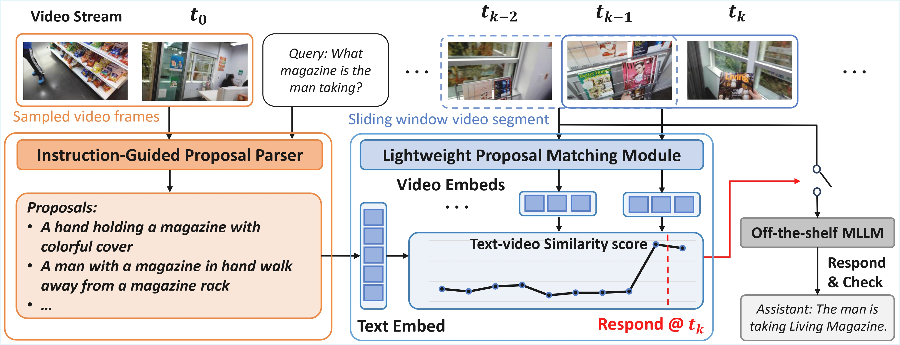

## The Implementation of *Em-Garde: A proposal-match framework for proactive streaming video understanding*



## Installation
Basic environment:

```
conda create -n em_garde python==3.10
conda activate em_garde
pip install -r requirements.txt
```

This project requires `ffmpeg` for video processing. Install it via your system package manager:

```
# Ubuntu/Debian
sudo apt install ffmpeg

# macOS
brew install ffmpeg

# Conda
conda install -c conda-forge ffmpeg
```

## Usage

run demo:

```
python -m demo --yaml-path=configs/demo/demo_solution
```

The video and query can be customized in `configs/demo`. Refer to `configs/demo/demo_solution.yaml`. The triggering results will be stored under `demo/`.

run proactive evaluation:

prepare [StreamingBench](https://github.com/THUNLP-MT/StreamingBench), [OVO-Bench](https://github.com/JoeLeelyf/OVO-Bench) and [ProactiveVideoQA](https://github.com/yellow-binary-tree/ProactiveVideoQA) data according to official repo. Note that we use `src_videos` instead of `chunked_videos` for OVO-Bench.


StreamingBench Evaluation:

```
python -m eval.streamingbench.streamingbench_eval_online --data-path=/path/to/StreamingBench/src/data/questions_proactive.json
```

OVO-Bench Evaluation:

```
python -m eval.ovo_bench.ovo_bench_eval_online --data-path=/path/to/OVO-Bench/data/ovo_bench_new.json --video-root=/path/to/OVO-Bench/data/src_videos
```

ProactiveVideoQA Evaluation (EGO):

```
python -m eval.proactive_video_qa.eval_proactive_video_qa --data-path=/path/to/proactive_video_qa/EGO/anno.json
```

Please follow [ProactiveVideoQA](https://github.com/yellow-binary-tree/ProactiveVideoQA) to compute the PAUC metric after obtaining the results.

## Acknowledgements

This codebase includes adapted code from the following public projects:

- `vlm2vec/` is based on [VLM2Vec](https://github.com/TIGER-AI-Lab/VLM2Vec).
- `embedding_models/ops_mm_embedding_v1.py` is adapted from [Ops-MM-Embedding](https://huggingface.co/OpenSearch-AI/Ops-MM-embedding-v1-2B).

We thank the original authors for making their code publicly available.

